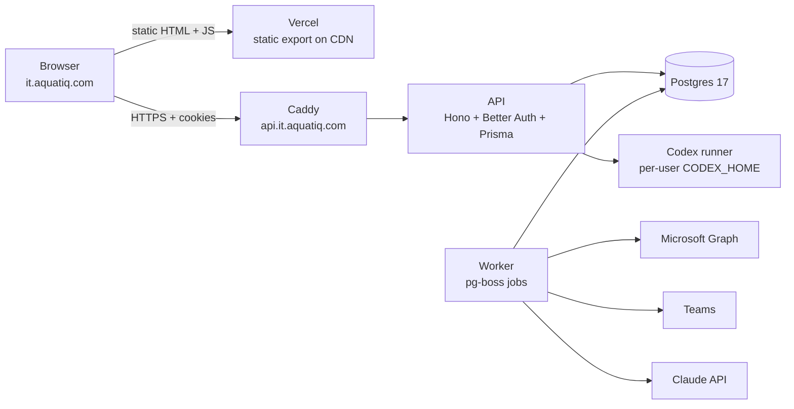

# IT Priorities — Platform & Feature Plan

_As of 2026-09-22 · Ima Da Costa · living copy, with comments: <https://claude.ai/code/artifact/378c4c97-cc77-40c0-9341-974a6748ef95>_

Vercel keeps only the static UI. The Hostinger VPS runs the API, the database, the background workers and the Codex runner. Seven phases, roughly 25–36 engineering days, and a running cost of $0–25 a month.

## Target architecture

Next.js cannot run half on Vercel and half elsewhere: a page is either rendered by a Next server or shipped as static files. The faithful version of "client side on Vercel, server side on the VPS" is a **static export** on Vercel and a dedicated API on the VPS. Server Components, Server Actions and route handlers all move into that API.

The browser talks to two hosts: Vercel for the files, the VPS for everything with state. Nothing on Vercel executes.

| Component | Runs on | Notes |
| --- | --- | --- |
| UI — Next.js `output: "export"` | Vercel | Static files on the CDN. No functions, so no cold starts and no Hobby cron limits. |
| API — Hono + Better Auth + Prisma | VPS, Docker | Auth, tasks, notes, users, AI endpoints, Graph webhooks. Cookie domain `.aquatiq.com`; CORS locked to `it.aquatiq.com`. |
| Postgres 17 | VPS, Docker | Same box as the API: sub-millisecond queries, no scale-to-zero. Nightly `pg_dump` shipped off the box. |
| Worker — pg-boss | VPS, Docker | Mail sync, triage, notifications, digests, webhook renewal. Postgres-backed queue, so no Redis. |
| Codex runner | VPS, Docker + volume | The former codex-bridge: one `codex app-server` per call, credentials on a persistent volume. |
| Caddy | VPS | TLS from Let's Encrypt, reverse proxy, rate limiting. |
| Claude — Microsoft Foundry or Anthropic API | external | Background automation only: triage, reply drafts, task plans. Company key, never personal subscriptions. |

The browser calls `api.it.aquatiq.com` directly rather than through a Vercel rewrite. The assistant streams for minutes and mail features will use server-sent events; a proxy hop in that path is a timeout waiting to happen.

Every variable the stack needs, per service and per phase, is listed in [deploy/vps/.env.example](../deploy/vps/.env.example).

## Decisions to make first

Five decisions gate Phase 1. None needs code.

| Decision | Options | Recommendation |
| --- | --- | --- |
| Vercel plan | Hobby (free, non-commercial terms) · Pro ($20/mo) | **Pro.** A company tool on Hobby is outside Vercel's terms even as static hosting. If $20/mo is not worth it, the static UI can live on the VPS too and Vercel drops out entirely. |
| VPS region and size | Hostinger EU datacentre; KVM 2 (2 vCPU, 8 GB) or larger | **EU region, KVM 2 minimum.** Postgres, API, worker and Codex runner fit in 8 GB; the Codex CLI is the heaviest tenant. |
| AI provider for automation | Claude via Microsoft Foundry · Anthropic API · Azure OpenAI | **Claude via Foundry** if available in the tenant's EU region: same tenant, enterprise data terms. Otherwise the Anthropic API. Never personal Codex subscriptions for background jobs. |
| Mail scope | Shared mailbox (e.g. it@aquatiq.com) · personal inboxes | **Shared mailbox first.** Most of the value, a fraction of the GDPR exposure, and Exchange can scope the app's permission to that one mailbox. |
| AI-policy gate | Ship mail features before or after the policy (board item 3, week 38) | **After.** Triage reads colleagues' email with a model; the policy should say that is allowed and how. |

Also name who owns the VPS operationally. Backups, patching and restore drills need a person, not "IT".

## Cost, before and after

The move removes the two meters that could grow, Sandbox and Neon compute, and adds one small predictable one.

| Item | Today | After the move |
| --- | --- | --- |
| Vercel | $0 (Hobby) | $0 Hobby, or $20/mo Pro |
| Neon Postgres | $0 (Free, 100 CU-hours cap) | $0 — decommissioned after cutover |
| Vercel Sandbox | ≈ $3–15/mo at real use | $0 — replaced by the Codex runner |
| Hostinger VPS | already paid | already paid, no new line |
| Claude API (triage, drafts, plans) | — | ≈ $1–5/mo: a few hundred emails a day on Haiku 4.5 |
| Codex subscriptions | existing seats | existing seats, interactive use only |
| **New spend** | **$0** | **$1–25/mo** |

## Data model changes

The `Owner` enum is the one change everything else depends on: a third person cannot join two hardcoded lanes.

| Table | Change | Purpose |
| --- | --- | --- |
| `Task` | `owner` enum → `ownerId` FK to `AllowedUser`; add `status` (Backlog, In progress, Blocked, Done), `priority` (P1–P4), `dueDate`, `effort` (S/M/L), `archivedAt`, `sourceMessageId` | Dynamic lanes for Aurora, tracking, the priority list, due dates, archive, link to the originating email |
| `TaskNote` (new) | `taskId`, `authorId`, `body` as markdown, `createdAt` | Many notes per task; replaces the single `notes` column |
| `TaskEvent` (new) | `taskId`, `actorId`, `type`, `before`, `after`, `createdAt` | Status history and audit log; feeds notifications and the NIS2 trail |
| `SuggestedTask` (new) | `messageId`, `subject`, `sender`, `summary`, `classification`, `confidence`, `state`, `taskId?` | Triage output awaiting a human's accept or reject |
| `MailMessage` (new) | `graphId`, `receivedAt`, `from`, `subject`, `webLink` | Minimal cache of synced mail; bodies stay in Exchange |
| `NotificationPreference` (new) | `userId`, `channel`, `events` | Who gets Teams or email for which events |
| `AllowedUser` | add `teamsUserId` | Lane identity and Teams mentions; `codexConnectedAt` stays |
| Better Auth tables | unchanged | Sessions and Microsoft accounts |

Migrations keep running through Prisma Migrate, now against the VPS database.

## Phased plan

Phases 1–3 ship together as one cutover. Phases 4–7 land incrementally on the new stack. Effort is engineering days for one person and does not include waiting on decisions or Azure approvals.

| Phase | Scope | Exit criteria | Days |
| --- | --- | --- | --- |
| 0 — Decisions & prep | The five decisions above; DNS for `api.it.aquatiq.com`; second Azure redirect URI; Graph permissions requested | Decisions written down; DNS resolves | 1–2 |
| 1 — VPS platform | Docker Compose with Caddy, Postgres, API, worker, Codex runner; firewall on 22/80/443 only; SSH keys only; unattended upgrades; nightly backup off the box; uptime check; GitHub Actions deploy | `docker compose up` from a clean VPS; one restore from backup rehearsed | 2–3 |
| 2 — Backend API | Hono + Better Auth + Prisma; every Server Action and route handler ported; cross-subdomain cookies and CORS; Codex runner wired; Neon data copied | Sign-in from a static preview works end to end; every board operation passes an API smoke test | 4–6 |
| 3 — Static UI | `output: "export"`; pages become client components on TanStack Query; typed API client; Vercel serves files only | The Vercel preview drives the VPS API with zero functions deployed | 3–4 |
| 4 — Foundation features | Dynamic owners (Aurora); status + history; multi-notes; priority + Focus view; due dates; audit log; search and filter; archive; live sync by polling | Aurora has a lane; every change shows in the activity log | 4–6 |
| 5 — Notifications | Teams post on status change; 08:00 daily digest Mon–Fri; Monday leadership digest; per-user preferences | Robert receives a digest built from the real board | 2–3 |
| 6 — Mail intelligence | Shared-mailbox delta sync; Claude triage to `SuggestedTask`; approval UI; task linked to mail; reply drafts saved to Outlook, never sent | A real email becomes an approved task in under five minutes | 5–8 |
| 7 — Assistant upgrades | Task plan drafts; automation assessments; recurring tasks; effort sizing; all saved as notes | A task gets a plan and an assessment from one click | 3–4 |
| **Total** | | | **25–36** |

Phase 6 starts only after the AI policy from board item 3 is agreed.

## Cutover without downtime

The current app keeps running on Vercel and Neon until the new stack is proven. Nothing switches until the rehearsal passes, and rollback at every step is a DNS change back.

1. Build phases 1–3 on a branch. Deploy the static UI to a Vercel preview at `it-staging.aquatiq.com`, pointed at the VPS API.
2. Copy Neon to the VPS with `pg_dump` and `pg_restore`; copy again on cutover night so nothing is lost.
3. Add both redirect URIs to the Azure app registration up front, so either stack can sign in.
4. Rehearse on staging: sign in, drag a card, add a task, connect Codex, run a turn.
5. Cutover: freeze edits for ten minutes, final data copy, point `it.aquatiq.com` at the static deployment. `api.it.aquatiq.com` is already live.
6. Keep Neon read-only for two weeks as the rollback, then delete it. Sandbox usage stops with it.

## Feature backlog

Each request maps to a phase. The nine asked for come first; the rest are the recommendations from the audit.

| # | Feature | Phase | How |
| --- | --- | --- | --- |
| 4 | Add Aurora | today | Any signed-in user can add aurora.engum@aquatiq.com in Settings → Users now. Her own lane arrives with dynamic owners in Phase 4. |
| 1 | Status and tracking | 4 | `status` on the card, a history from `TaskEvent`, filters by status |
| 2 | Notes, many per task | 4 | `TaskNote` thread on each card: markdown, author, time |
| 5 | Priority list | 4 | `priority` P1–P4 on cards plus a Focus view: the top ten across all lanes |
| 8 | Notifications | 5 | Teams post when a task is created, changes status or is done; daily and Monday digests; each person picks their events |
| 3 | Mail sync and triage | 6 | Worker pulls the shared mailbox every 3 minutes via Graph delta; Claude classifies task, FYI or noise with a confidence; a Suggested inbox in the UI for accept or reject |
| 7 | Replies to the sender | 6 | Claude drafts the reply from the task and its notes; saved as an Outlook draft in the shared mailbox for a person to send |
| 6 | Task plans and automation assessment | 7 | One click writes a step plan and an assessment of which steps an AI tool can take and which need a person, both saved as notes |
| — | Due dates and overdue flag | 4 | The seed already carries week-40 and week-41 deadlines with nowhere to live |
| — | Audit log | 4 | `TaskEvent` shown per task and as a board-wide feed; useful for NIS2 |
| — | Search, filter, archive | 4 | Before the board passes two screens |
| — | Live sync between tabs | 4 | Poll every 15 s; server-sent events later if it grates |
| — | @mentions in notes | 5 | Mention a colleague in a note and they get a Teams message |
| — | Weekly leadership digest | 5 | The list came from a leadership document; close the loop every Monday |
| — | Recurring tasks | 7 | NIS2 reviews and access audits on a schedule |
| — | Effort sizing | 7 | S/M/L so plans have an anchor |

## Risks

| Risk | Likelihood | Handling |
| --- | --- | --- |
| The static-export rewrite is the largest single chunk and touches every page | certain | Build behind a preview; cut over once; roll back by DNS |
| Cross-subdomain cookies or CORS break sign-in | medium | Phase 2's exit criterion: prove it on staging before any UI work |
| One VPS is a single point of failure | certain | Nightly off-box backups, a rehearsed restore, an uptime check. Acceptable for an internal tool of six people |
| Codex credentials on a self-managed disk | medium | Encrypted volume, SSH keys only, firewall; the runner is reachable only from the API with a shared key |
| Vercel Hobby terms | medium | Decide Pro, or move the UI to the VPS too. Do not leave it open |
| Triage reads colleagues' email | policy | Gated on the AI policy; shared mailbox only; an Exchange application access policy limits the app to that one mailbox |
| Personal Codex subscriptions used for automation | avoided | Background AI runs on a company API key; Codex stays interactive |
| Neon deleted too early | low | Two weeks read-only after cutover |
| Graph webhook subscriptions expire in under three days | certain | Delta polling instead; webhooks optional later |

## Open questions

- [ ] Vercel Pro, or move the static UI to the VPS as well?
- [ ] Which Hostinger datacentre is the VPS in, and which plan?
- [ ] Is Claude available in Microsoft Foundry for the tenant's EU region, or do we use the Anthropic API?
- [ ] Which shared mailbox feeds triage, and who owns it?
- [ ] When does the AI policy from board item 3 land?
- [ ] Who owns the VPS operationally: backups, patches, restore drills?
- [ ] Does Aurora get her own lane from day one, or join Robert's until Phase 4?
- [ ] Does the interactive assistant stay on personal Codex subscriptions, or move to the company API too?
